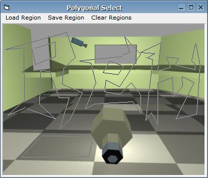



## Polygonal Line Drag v1\.1

### Description

This code allows to point and drag polygonal lines. This is particularly useful when you want to allow selection of a non-rectangular area in a picturebox.

UPDATE! [Version 1.1]: Added File Open/Save Function.
 
### More Info
 

             |
---                |---
**Submitted On**   |2005-05-11 01:12:02
**By**             |[Remerico Cruz](https://github.com/Planet-Source-Code/PSCIndex/blob/master/ByAuthor/remerico-cruz.md)
**Level**          |Intermediate
**User Rating**    |5.0 (15 globes from 3 users)
**Compatibility**  |VB 6\.0
**Category**       |[Coding Standards](https://github.com/Planet-Source-Code/PSCIndex/blob/master/ByCategory/coding-standards__1-43.md)
**World**          |[Visual Basic](https://github.com/Planet-Source-Code/PSCIndex/blob/master/ByWorld/visual-basic.md)
**Archive File**   |[Polygonal\_1886735112005\.zip](https://github.com/Planet-Source-Code/remerico-cruz-polygonal-line-drag-v1-1__1-60412/archive/master.zip)

